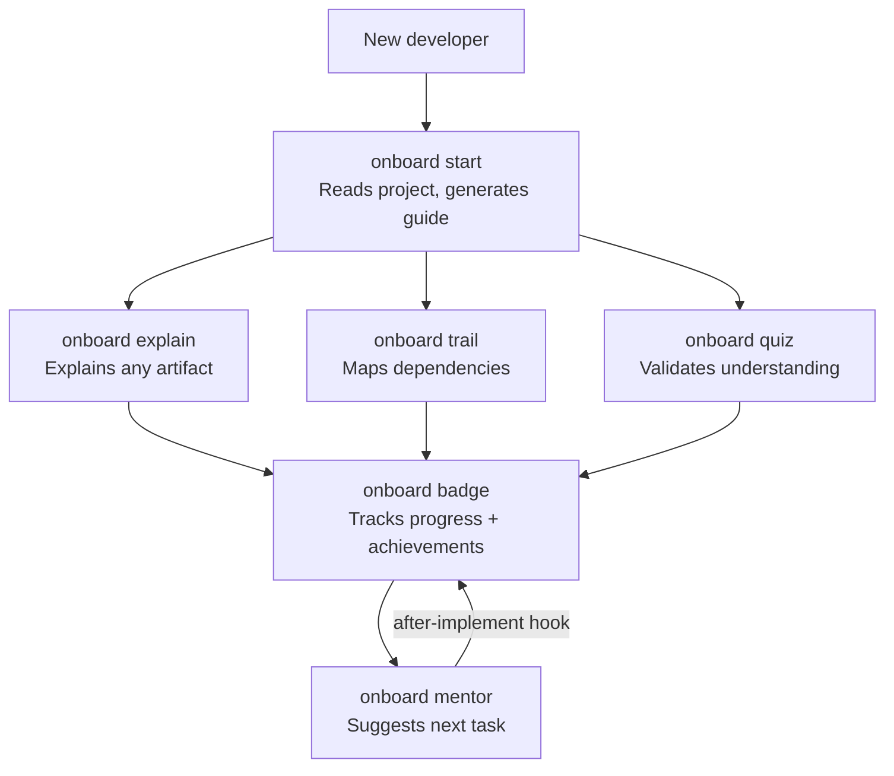

# spec-kit-onboard

[](https://github.com/dmux/spec-kit-onboard/releases)
[](LICENSE)
[](https://github.com/github/spec-kit)
[](https://github.com/github/spec-kit?tab=readme-ov-file#-community-extensions)

> spec-kit extension for contextual onboarding and progressive developer growth.

`onboard` guides developers from their first contact with a project to full autonomy — orienting before action, validating understanding, and suggesting the next step.

## Features

### Personalized onboarding guide

`/onboard start` reads all project artifacts (`memory.md`, specs, tasks, installed extensions) and generates a guide at `.onboard/guide.md` tailored to the developer's declared level. `junior` gets analogies and a full glossary; `mid` gets practical focus; `senior` gets dense, decision-oriented context.

### Multi-developer support

Each developer gets an isolated profile at `.onboard/profiles/<name>.json`. Running `/onboard start --dev "Maria" --level mid` creates or resumes Maria's profile without touching anyone else's history. Legacy single-profile setups are automatically migrated.

### Contextual explanations

`/onboard explain` accepts any target — a file path, a feature name, or an SDD concept — and explains it in language calibrated to the developer's level, citing the actual artifacts in the project.

### Dependency trail

`/onboard trail` generates a visual Mermaid map of a feature's tasks, blockers, hooks that will fire, and extensions involved. Saved to `.onboard/trails/<feature>.md`.

### Adaptive quiz

`/onboard quiz` generates 5 questions from the project's real artifacts — no generic definitions, no repeated questions across sessions. Questions are distributed across verifiable facts, simple inferences, and practical consequences. Level-calibrated: multiple choice for juniors, open answers for seniors.

### Smart task mentor

`/onboard mentor` scores all eligible open tasks using a weighted algorithm (level fit, natural progression, quiz gaps, already-read artifacts) and suggests the single best next task with a full briefing. Integrates with Jira and Azure DevOps when those extensions are installed.

### Progress and badges

9 badges track meaningful milestones — from `first-read` to `autonomous` (completing a full feature without needing `/onboard explain`). `/onboard badge` shows earned badges, locked ones, and partial progress toward each.

### Team visibility

`/onboard team` displays an overview of all developer profiles in the project. `--report` exports a full breakdown to `.onboard/team-report.md`, including features with no coverage and quiz gap analysis per developer.

---

## Workflow



---

## Installation

```bash
specify extension add onboard
```

That's it. The extension is listed in the [spec-kit community catalog](https://github.com/github/spec-kit?tab=readme-ov-file#-community-extensions) and installed via the `specify` CLI.

### Verify

```bash
specify extension list
```

### Install a specific version

```bash
specify extension add --from https://github.com/dmux/spec-kit-onboard/archive/refs/tags/v2.1.0.zip
```

### For local development

```bash
specify extension add --dev /path/to/spec-kit-onboard
```

---

## Commands

### `/onboard start`

Entry point. Reads all project artifacts and generates a personalized onboarding guide.

```bash
/onboard start
/onboard start --dev "Maria" --level junior
/onboard start --dev "Carlos" --level senior
```

Generates `.onboard/guide.md` with a project summary, feature map, recommended tasks, and a contextual glossary.

---

### `/onboard explain`

Explains any project artifact or SDD concept in plain language, calibrated to the developer's level.

```bash
/onboard explain features/auth/spec.md
/onboard explain features/payments
/onboard explain drift
/onboard explain hook
```

---

### `/onboard trail`

Generates a visual dependency map for a feature — tasks, blockers, hooks that will fire, and extensions involved.

```bash
/onboard trail auth
/onboard trail payments --format mermaid
```

Saves the map to `.onboard/trails/<feature>.md`.

---

### `/onboard quiz`

Validates the developer's understanding with 5 questions generated dynamically from the project's real artifacts.

```bash
/onboard quiz
/onboard quiz --feature auth
/onboard quiz --topic workflow
```

---

### `/onboard badge`

Displays the developer's progress as achievements.

```bash
/onboard badge
/onboard badge --list
/onboard badge --reset
```

**Available badges:**

| Badge           | Criterion                                                    |
| --------------- | ------------------------------------------------------------ |
| `first-read`    | First `/onboard explain`                                     |
| `map-reader`    | First `/onboard trail`                                       |
| `navigator`     | Quiz score of 5/5                                            |
| `first-task`    | First task completed                                         |
| `clean-pass`    | Task completed with no cleanup issues                        |
| `spec-aware`    | Read all specs of a feature before implementing              |
| `full-trail`    | Trail generated for all open features                        |
| `mentor-streak` | Followed the mentor's suggestion 3 times in a row            |
| `autonomous`    | Completed an entire feature without using `/onboard explain` |

---

### `/onboard mentor`

Suggests the next most suitable task based on the developer's level and history, with enough context to start immediately.

```bash
/onboard mentor
/onboard mentor --feature auth
```

---

## Generated files

All generated files go inside `.onboard/` in the user's project (gitignored by default):

```text
.onboard/
├── profile.json    — developer profile and progress
├── guide.md        — guide generated by /onboard start
└── trails/
    └── <feature>.md — maps generated by /onboard trail
```

---

## Integration with other extensions

| Extension                 | Integration                                                                    |
| ------------------------- | ------------------------------------------------------------------------------ |
| `cleanup`                 | `after-implement` hook reads the result to calculate the `clean-pass` badge    |
| `verify` / `verify-tasks` | `/onboard trail` lists the hooks that will fire during the feature cycle       |
| `docguard`                | `/onboard explain` displays the spec quality score (v1.1.0)                    |
| `learn`                   | `/onboard start` mentions `/learn guide` for post-implementation consolidation |

---

## Requirements

- spec-kit >= 0.1.0
- No external dependencies
